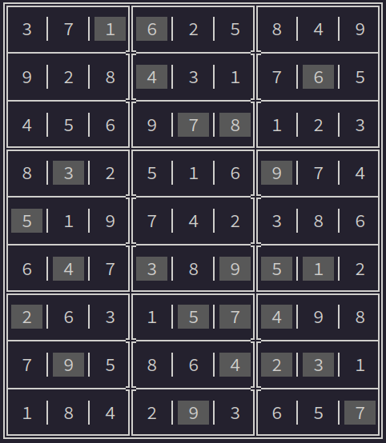

# Sudoku Solver

<p align="center">
  
</p>

## Overview

The **Sudoku Solver** is a C program that uses a backtracking algorithm to solve 9x9 Sudoku puzzles. This project includes the solver, a test suite, and a Makefile for building and running the program. The solver reads an initial board configuration from a file, solves the puzzle, and prints both the initial and solved states of the board.

## Features

- **Backtracking Algorithm:** Efficiently solves 9x9 Sudoku puzzles.
- **Input Handling:** Reads Sudoku puzzles from text files.
- **Board Validation:** Ensures that the board adheres to Sudoku rules during the solving process.
- **Test Suite:** Includes a test suite to validate the solver against various Sudoku puzzles.
- **Command-Line Interface:** Simple and easy-to-use CLI for running the solver.

## Table of Contents

- [Installation](#installation)
- [Usage](#usage)
- [File Structure](#file-structure)
- [Testing](#testing)
- [Contributing](#contributing)
- [License](#license)

## Installation

### Prerequisites

- GCC (GNU Compiler Collection)
- Make
- Bash

### Building the Project

To build the project, clone the repository and run the following command:

```bash
make
```

This will compile the `sudoku` executable.

## Usage

### Solving a Sudoku Puzzle

To solve a Sudoku puzzle, run the `sudoku` program with the path to a text file containing the puzzle:

```bash
./sudoku <FILENAME>
```

### Puzzle File Format

Each Sudoku puzzle should be represented as a 9x9 grid in a text file, with empty cells represented by spaces or any other non-numeric character that you choose to use. Example:

```
74  1 5
   3   9
596   4
    42
   1   5
 81  7 39
   6
 3      8
```

## Testing

### Running the Test Suite

To run the test suite, which compiles and executes the tests against various puzzles, use:

```bash
chmod +x tests/test_sudoku.sh
./tests/test_sudoku.sh
```

This script will compile the test suite, run the tests on the puzzles, and display the results.

### Cleaning Up

To clean up compiled files and binaries, run:

```bash
make clean
```

## License

This project is licensed under the MIT License - see the [LICENSE](LICENSE) file for details.
